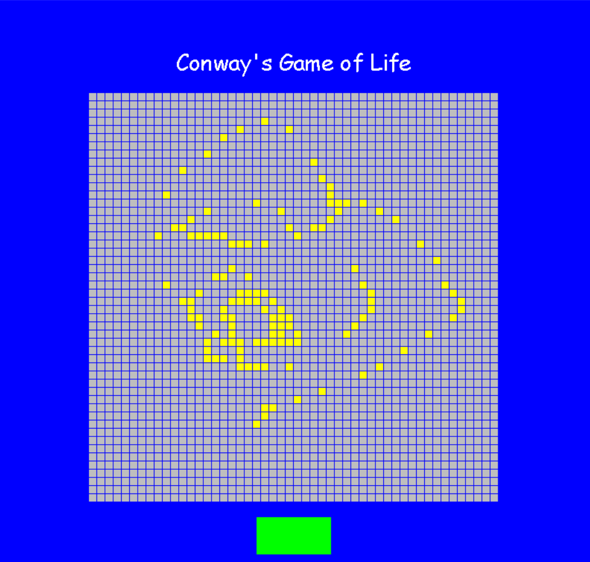

John Conway's Game of Life 

Introduction 

John Conway's Game of Life is a game which is based on simple mathethematical rules but can often produce complex and interesting patterns. In the game, there is a board composed of cells. Given a starting configuration input by the users, the cells either "die" or become "alive" if the following conditions are met: 

- if a cell is alive, it stays alive if it has two or three neighbors which are alive
- if a cell is alive, it dies if it has more than three neighbors (overpopulation) 
- if a cell is alive, it dies if it has less than two neighbors 
- if a cell is dead, it becomes alive if it has three neighbors (reproduction) 

Implementation 

This implemenation was created uisng PyGame, a useful Python gaming library. A grid is represented by a pygame.Rect, and each cell is stored in a two-dimensional array. If the user clicks on a specific cell before starting the simulation, it becomes "alive" using the pygame.colliderect method. Once the simulation has started, the cells are constantly iterated over and the state of the cell for the next iteration is recorded. The GUI is then updated once the logic has updated the internal state of each of the cells. This continues until the user presses the stop button. 

